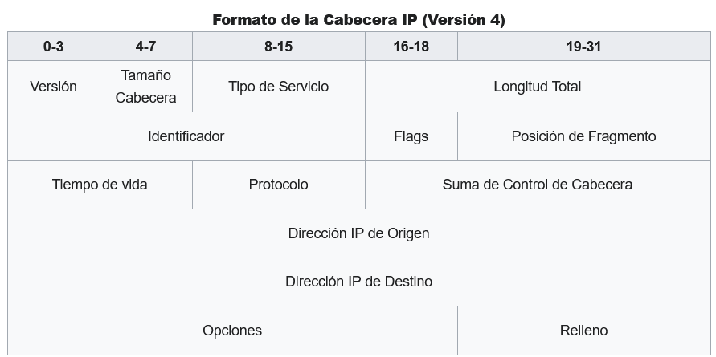
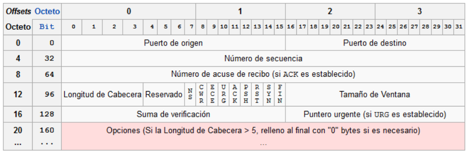
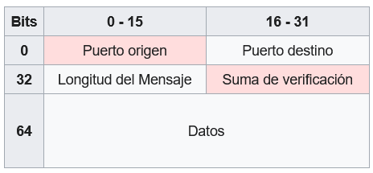
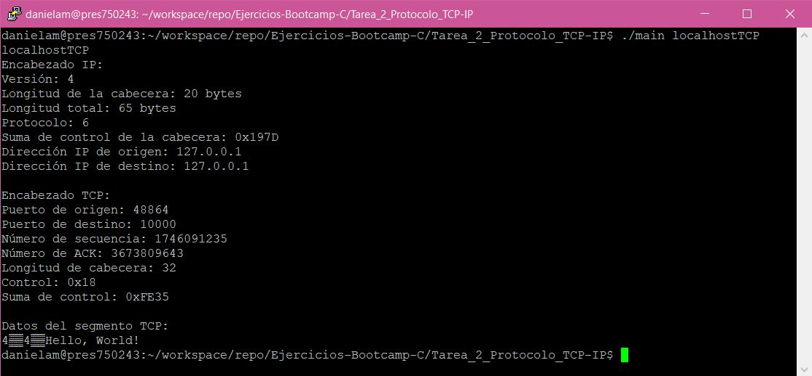
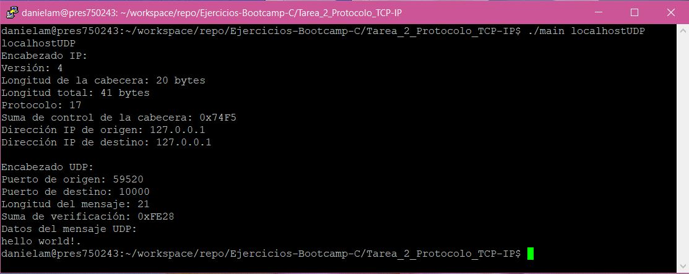
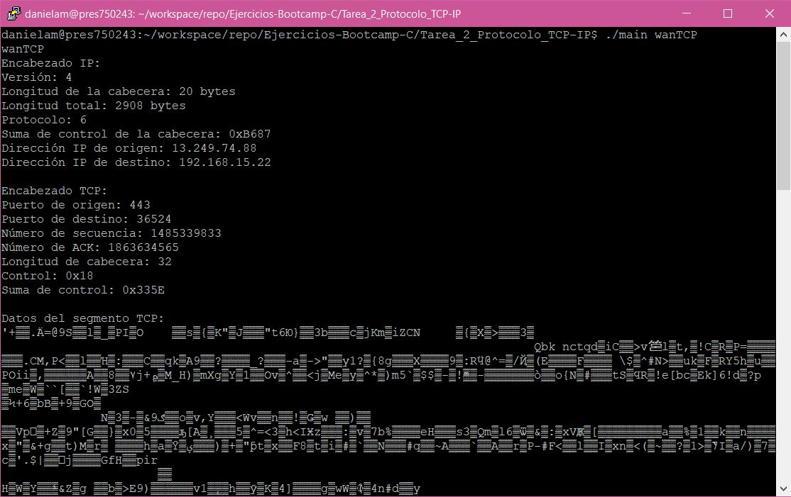
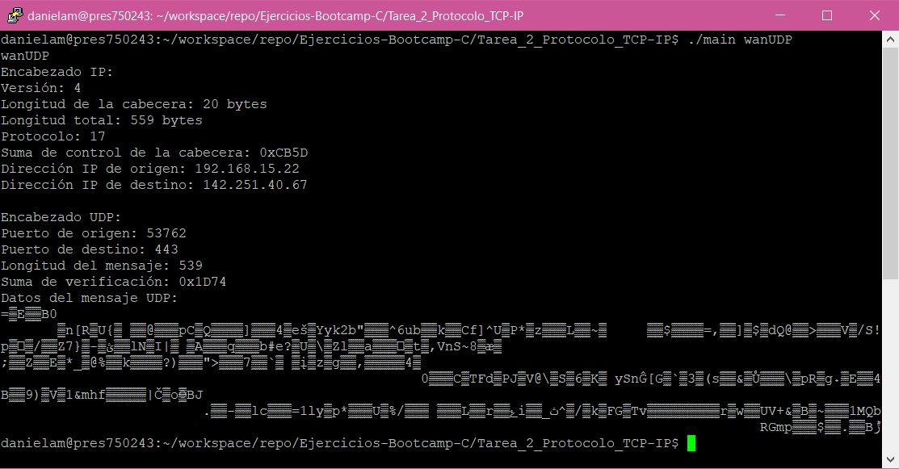

# 🔻 Decodificación de paquetes TCP/IP

## Requerimientos 📝

- Implementar una aplicación que decodifique un paquete de TCP/IP.
- El paquete de TCP/IP se obtendrá desde un archivo.
- El nombre del archivo con el paquete TCP/IP, deberá ser pasado como argumento del ejecutable.
- La aplicación deberá ser capaz de diferenciar entre los encabezados de IP, TCP y UDP.
- La información que se mostrará del encabezado de IP es:  
  - Versión
  - Tamaño Cabecera
  - Longitud Total
  - Protocolo
  - Suma de Control de Cabecera
  - Dirección IP de origen
  - Dirección IP de destino
- La información que se mostrara del encabezado de TCP es:
  - Puerto de origen
  - Puerto de destino
  - Número de secuencia
  - Número de ACK
  - Longitud de la cabecera
  - Control
  - Checksum
  - Datos
- La información que se mostrara del encabezado de UDP es:
  - Puerto Origen
  - Puerto Destino
  - Longitud del Mensaje
  - Suma de verificación
  - Datos

## Implementación 🚀

### 🔖 A tomar en consideración

- El encabezado IP tiene una longitud fija de 20 bytes (160 bits) para IPv4.

- El encabezado TCP tiene una longitud mínima de 20 bytes (160 bits) y puede tener opciones adicionales que aumentan su longitud.

- El encabezado UDP tiene una longitud fija de 8 bytes (64 bits).

En resumen:

    IPv4: Encabezado IP = 20 bytes (160 bits); Encabezado TCP mínimo = 20 bytes (160 bits); Encabezado UDP = 8 bytes (64 bits).

### Análisis de los paquetes 🔎

Para analizar los encabezados IP, TCP y UDP en un archivo de paquete TCP/IP usando el lenguaje de programación C, es necesario abrir el archivo, leer los datos del archivo y analizar los encabezados de cada paquete en el archivo. Para leer los datos del archivo, se utilizó la función **fread()** de la biblioteca estándar de C. Para analizar los encabezados, se trabajaron con los datos en bruto en forma de bytes.

A continuación, se detallan los pasos generales que se siguieron para extraer la información de cada encabezado:

1. Se definieron tres estructuras para cada tipo de encabezado con los campos correspondientes.
2. Se abre el archivo binario pasado como argumento en la línea de comandos utilizando **fopen()** y se comprueba si se ha podido abrir correctamente. Si no se ha especificado un archivo, se devuelve un código de error.
3. Para analizar el encabezado correspondiente a la IP, se leen los primeros 14 bytes correspondientes al encabezado Ethernet y se descartan utilizando **fread()** y **fseek()**.
4. A partir del byte 14, se leen los próximos 20 bytes, que corresponden al encabezado IP y se almacenan en la estructura **ip_header**. Los campos se extraen de los datos utilizando máscaras y desplazamientos de bits.
5. Analizar los bits en el encabezado IP para extraer la información necesaria. Los campos de interés son:
    - **Versión**: Analizar el primer byte del encabezado IP para obtener la versión del protocolo.
    - **Longitud de la cabecera**: Analizar el segundo byte del encabezado IP para obtener la longitud de la cabecera. Como la longitud de la cabecera se expresa en palabras de 32 bits, se debe multiplicar por 4 para obtener la longitud en bytes.
    - **Longitud total**: Analizar los bytes 3 y 4 del encabezado IP para obtener la longitud total del paquete.
    - **Protocolo**: Analizar el noveno byte del encabezado IP para obtener el protocolo. Este valor indicará si el siguiente encabezado es TCP o UDP.
    - **Suma de control de la cabecera (checksum)**: Analizar los bytes 11 y 12 del encabezado IP para obtener la suma de control de la cabecera.
    - **Dirección IP de origen**: Analizar los bytes del 13 al 16 del encabezado IP para obtener la dirección IP de origen.
    - **Dirección IP de destino**: Analizar los bytes del 17 al 20 del encabezado IP para obtener la dirección IP de destino.
6. Convertir los valores binarios obtenidos a números decimales para su comprensión e imprimirlos en pantalla.
7. Para saber si se trata del encabezado TCP o UDP, se declararon dos condicionales, si el protocolo del encabezado IP es igual a 6, se trata del encabezado TCP, pero si el protocolo es igual a 17, se trata del encabezado UDP.
8. Si el protocolo de capa superior es TCP, se lee el encabezado TCP que comienza después del encabezado IP y se extrae la información de los campos requeridos, la cual es almacenada en la estructura **tcp_header**. Los campos se extraen de los datos utilizando máscaras y desplazamientos de bits.
    - **Puerto de origen**: Analizar los bytes 0 y 1 del encabezado TCP para obtener el puerto de origen.
    - **Puerto de destino**: Analizar los bytes 2 y 3 del encabezado TCP para obtener el puerto de destino.
    - **Número de secuencia**: Analizar desde los bytes 4-7 del encabezado TCP para obtener el número de secuencia.
    - **Número de ACK**: Analizar desde los bytes 8-11 del encabezado TCP para obtener el número de ACK.
    - **Longitud de la cabecera**: Analizar el byte 12 del encabezado TCP para obtener la longitud de la cebecera.
    - **Control**: Analizar el byte 13 del encabezado TCP para obtener los bits de control.
    - **Suma de verificación de la cabecera (checksum)**: Analizar los bytes 16 y 17 del encabezado TCP para obtener la suma de control de la cabecera.
9. Convertir los valores binarios obtenidos a números decimales para su comprensión e imprimirlos en pantalla.
10. Se leen los siguientes bytes correspondientes a los datos del segmento TCP y se imprimen en pantalla.
11. Si el protocolo de capa superior es UDP, se lee el encabezado UDP que comienza después del encabezado IP y se extrae la información de los campos requeridos, la cual es almacenada en la estructura **udp_header**. Los campos se extraen de los datos utilizando máscaras y desplazamientos de bits.
    - **Puerto de origen**: Analizar los bytes 0 y 1 del encabezado UDP para obtener el puerto de origen.
    - **Puerto de destino**: Analizar los bytes 2 y 3 del encabezado UDP para obtener el puerto de destino.
    - **Longitud del mensaje**: Analizar los bytes 4 y 5 del encabezado UDP para obtener la longitud del mensaje.
    - **Suma de verificación de la cabecera (checksum)**: Analizar los bytes 6 y 7 del encabezado UDP para obtener la suma de verificación.
12. Si hay datos adicionales después del encabezado UDP, se leen los bytes adicionales del paquete y se imprimen en pantalla.
13. Una vez que se finaliza la lectura de datos, se cierra el archivo con la función **fclose()**.

## Código 📌

🔗 Para consultar el código de la implementación lo puedes encontrar [aquí](main.c).

🔗 Para comprobar los datos arrojados por el código, se uso como base el archivo [Descripción de los paquetes](Packages.md).

A continuación, se muestran las capturas de pantalla a la terminal para cada archivo decodificado.

